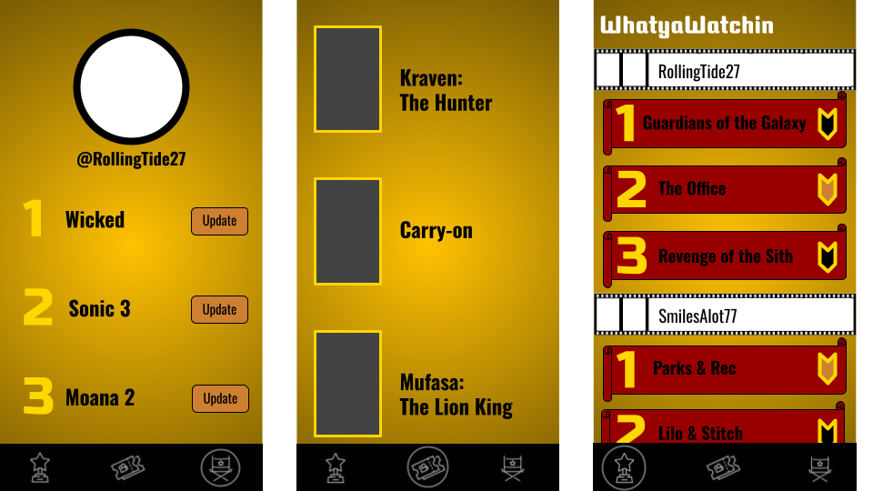
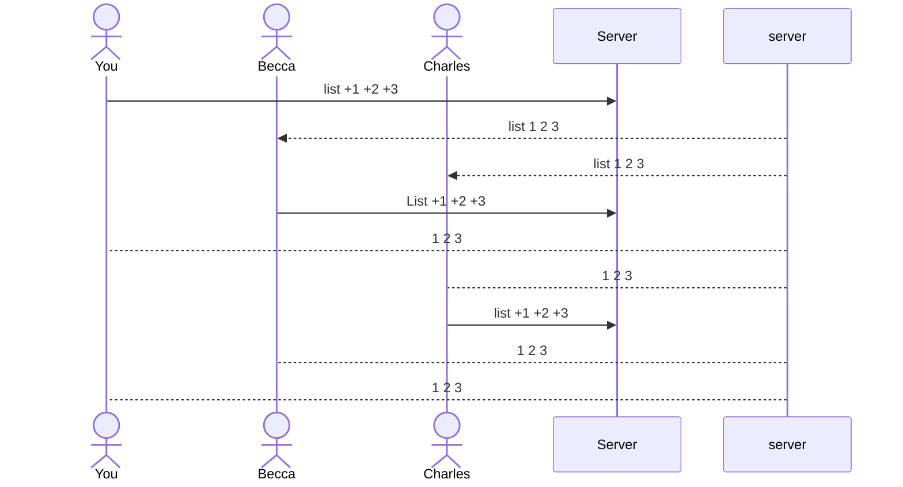

#WhatayaWatchin 

[My Notes](notes.md)

> [!NOTE]
>  This is a template for your startup application. You must modify this `README.md` file for each phase of your development. You only need to fill in the section for each deliverable when that deliverable is submitted in Canvas. Without completing the section for a deliverable, the TA will not know what to look for when grading your submission. Feel free to add additional information to each deliverable description, but make sure you at least have the list of rubric items and a description of what you did for each item.

> [!NOTE]
>  If you are not familiar with Markdown then you should review the [documentation](https://docs.github.com/en/get-started/writing-on-github/getting-started-with-writing-and-formatting-on-github/basic-writing-and-formatting-syntax) before continuing.

## 🚀 Specification Deliverable

> [!NOTE]
>  Fill in this sections as the submission artifact for this deliverable. You can refer to this [example](https://github.com/webprogramming260/startup-example/blob/main/README.md) for inspiration.

For this deliverable I did the following. I checked the box `[x]` and added a description for things I completed.

- [x] Proper use of Markdown
- [x] A concise and compelling elevator pitch
- [x] Description of key features
- [x] Description of how you will use each technology
- [x] One or more rough sketches of your application. Images must be embedded in this file using Markdown image references.

### Elevator pitch

Have you ever struggled to find something to watch before your food gets cold? Have you ever spent more time looking for something to watch then actually watching something? Are you looking for an easy conversation starter with someone you like? Then **_WhatyaWatchin_** is for you! **_WhatyaWatchin_** allows you to post your top 3 favorite movies or tv series that you've watched in the past week. With your account you can easily update your top 3 every week and see what others are also choosing to watch. It's a much more friendly and personal approach to finding something to watch and can help you narrow down searches from huge libraries to close friends and families. Scroll through everyones top picks and click the save button to make your own watchlist! 

### Design

Here is a diagram displaying the sequence of how people would interact with the backend to share lists with others. 

### Key features

- Secure login over HTTPS
- Ability to type in 3 movie/tv-show titles to share 
- Ability to save titles from other accounts to personal account
- Separate pages displaying:
  1. lists from other users 
  2. Saved titles
  3. Personal account profile

### Technologies

I am going to use the required technologies in the following ways.

- **HTML** - Two HTML pages for login and main page interface getting input title names from user. After one week, clear users lists and remind users to input a new list after clearing the titles.
- **CSS** - Styling with vibrant colors for each page displaying usernames and numbered lists with bold fonted movie and tv titles
- **React** - Login data collection. Choice of display whether homepage, saved titles page, or profile page.  Routing and components to work interface. 
- **Service** - Backend service with endpoints for:
    - login
    - retrieving 3 titles
    - pushing usernames with their list retrieved to other users
    - retrieve movie titles from large database containing information on the movies inputed
- **DB/Login** - Store top 3 titles entered by user and saved list created by user.
- **WebSocket** - When users update their list of titles for that week, their list is broadcast to all the other users homepage

## 🚀 AWS deliverable

For this deliverable I did the following. I checked the box `[x]` and added a description for things I completed.

- [x] **Server deployed and accessible with custom domain name** - [My server link](https://whatyawatchin.click).

## 🚀 HTML deliverable

For this deliverable I did the following. I checked the box `[x]` and added a description for things I completed.

- [x] **HTML pages** - I made 4 HTML pages: index, home, saved, and account
- [x] **Proper HTML element usage** - I followed the standard by including a head, body, header, main, and footer elements
- [x] **Links** - I added links that direct to the HTML pages and added my github link into the footer 
- [x] **Text** - I added text where it will be displayed on each page
- [x] **3rd party API placeholder** - I'm not sure if my application has this
- [x] **Images** - I added icon images for the navigation elements
- [x] **Login placeholder** - On Index.html I added input boxes for username and password and also buttons to proceed to home
- [x] **DB data placeholder** - On the saved.html is where users saved movie titles will be displayed and can be marked as watched
- [x] **WebSocket placeholder** - On the home page, users top 3 movies will be posted to other users home page with their ranking, movie title, rating, and the ability to save the titles to your own account.

## 🚀 CSS deliverable

For this deliverable I did the following. I checked the box `[x]` and added a description for things I completed.

- [x] **Header, footer, and main content body** - I styled the header with a new font and made it fixed to the top of the page. The body has a gradient image background and is flexable to the scroller. The footer is also styled and fixed to the bottom. 
- [x] **Navigation elements** - I integrated a link to the home page with the title card of the page. I made link to home, save, and account as the main pages centered in the header, and made a seperate, far-right login link button. 
- [x] **Responsive to window resizing** - It is responsive to window resizing but could use some fine tuning for small screens like phones.
- [x] **Application elements** - Most application elements are put into containers and displayed as such. The home page is where users will see other users input and rankings of moves with a save button next to each move title. The saved page displays the movies that the user saved with a button to click when that movie is watched (I hope to add a remove button too) and at the top is a quick google search bar to search the movies you saved without leaving the page, The account page displays the users profile picture and their ranked movies in a conatiner. This is where the user changes their titles and rankings through the lower portion of the account page.
- [x] **Application text content** - Most of the text is placeholders for what will eventually be added in but all button elements and links have their appropriate labels
- [x] **Application images** - Most of the images are used in helping to naviagate and understand the rankings and also the save buttons on the homepage (I hope to add pictures to maybe the saved page)

## 🚀 React part 1: Routing deliverable

For this deliverable I did the following. I checked the box `[x]` and added a description for things I completed.

- [x] **Bundled using Vite** - I followed the example given with Simon and added a package.json and package-lock.json file. I was successful in using npm as well
- [x] **Components** - login, home, saved, and account are all components. Home will house the websocket data where placeholders are currently, saved will use an outside resource to bring in information about movies, and account will have ratability of movies.
- [x] **Router** - Routing between login and voting components was successful

## 🚀 React part 2: Reactivity

For this deliverable I did the following. I checked the box `[x]` and added a description for things I completed.

- [ ] **All functionality implemented or mocked out** - I did not complete this part of the deliverable.
- [ ] **Hooks** - I did not complete this part of the deliverable.

## 🚀 Service deliverable

For this deliverable I did the following. I checked the box `[x]` and added a description for things I completed.

- [ ] **Node.js/Express HTTP service** - I did not complete this part of the deliverable.
- [ ] **Static middleware for frontend** - I did not complete this part of the deliverable.
- [ ] **Calls to third party endpoints** - I did not complete this part of the deliverable.
- [ ] **Backend service endpoints** - I did not complete this part of the deliverable.
- [ ] **Frontend calls service endpoints** - I did not complete this part of the deliverable.

## 🚀 DB/Login deliverable

For this deliverable I did the following. I checked the box `[x]` and added a description for things I completed.

- [ ] **User registration** - I did not complete this part of the deliverable.
- [ ] **User login and logout** - I did not complete this part of the deliverable.
- [ ] **Stores data in MongoDB** - I did not complete this part of the deliverable.
- [ ] **Stores credentials in MongoDB** - I did not complete this part of the deliverable.
- [ ] **Restricts functionality based on authentication** - I did not complete this part of the deliverable.

## 🚀 WebSocket deliverable

For this deliverable I did the following. I checked the box `[x]` and added a description for things I completed.

- [ ] **Backend listens for WebSocket connection** - I did not complete this part of the deliverable.
- [ ] **Frontend makes WebSocket connection** - I did not complete this part of the deliverable.
- [ ] **Data sent over WebSocket connection** - I did not complete this part of the deliverable.
- [ ] **WebSocket data displayed** - I did not complete this part of the deliverable.
- [ ] **Application is fully functional** - I did not complete this part of the deliverable.
